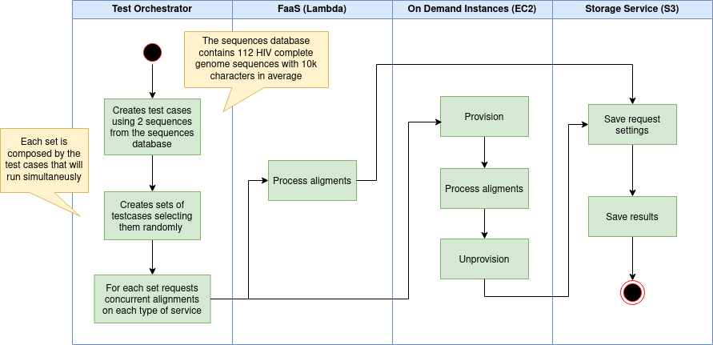

# Biological sequences alignment
This project intends to perform biological sequences alignment using FASTA format in different cloud services such as on-demand instances (AWS EC2) and function as a service (Lambda). 

## Alghorithm

- Hirschberg

## Application

This project was developed on Python 3.6 and used these libraries:
  - alignment (https://github.com/leebird/alignment)
  - boto3 (AWS S3 integration)
  - base64 (request data manipulation)
  - fastapi (used for receive API requests on on-demand instances)
  - asyncio (used to perfom paralel processment on on-demand instances)

The source codes of FaaS deployments and Python native (with fastapi) application is available on https://github.com/unb-faas/sequence_comparison_app

## Workflow

## Scripts
 - **generateTestCases.sh**
    - Reads files with FASTAs in a passed directory and generates files (.json) containing 2 sequences to be used as "test cases".
 - **raffle.sh**
    - Since the test case set is generated, this script generates subsets of test cases collected randomly from the main set of test cases. This creates sets that can be run concurrently on different types of services.
 - **play.sh**
    - Runs the alignments based on paramethers passed: credentials, type of test, debug, etc. In case of on-demand instance this script will provision the instance using the blueprint defined for Terraform in "provision" folder, and in the end of each test case the instance will be deprovisioned.
 - **sumDate.sh** 
    - Calculates the average of date in a list. This is script is used to calculate de full results and can be used for obtain partial results.
 - **generateResults.sh**
    - After the execution of the test cases, this script can be used to generate the full results in CSV format. From a path informed, it will read the generated JSON files and extrac the metrics used on this study such as "test duration", "average alignment duration", "average score obtained", "average legnth of sequences", etc.

## Sequences
- FJ495818.1HIV-1isolateCH40E_flA1fromUSA,completegenome.fasta
- FJ495819.1HIV-1isolateCH40E_flA2fromUSA,completegenome.fasta
- FJ495820.1HIV-1isolateCH40E_flA3fromUSA,completegenome.fasta
- FJ495821.1HIV-1isolateCH40E_flC7fromUSA,completegenome.fasta
- FJ495822.1HIV-1isolateCH40E_flF10fromUSA,completegenome.fasta
- FJ495823.1HIV-1isolateCH40E_flF7fromUSA,completegenome.fasta
- FJ495824.1HIV-1isolateCH40E_flF9fromUSA,completegenome.fasta
- FJ495825.1HIV-1isolateCH40E_flG3fromUSA,completegenome.fasta
- FJ495826.1HIV-1isolateCH40E_flG6fromUSA,completegenome.fasta
- FJ495937.1HIV-1isolateCH58E_flA1fromUSA,completegenome.fasta
- FJ495938.1HIV-1isolateCH58E_flA6fromUSA,completegenome.fasta
- FJ495939.1HIV-1isolateCH58E_flA7fromUSA,completegenome.fasta
- FJ495940.1HIV-1isolateCH58E_flA8fromUSA,completegenome.fasta
- FJ495941.1HIV-1isolateCH58E_flA9fromUSA,completegenome.fasta
- FJ495942.1HIV-1isolateCH58E_flC4fromUSA,completegenome.fasta
- FJ495943.1HIV-1isolateCH58E_flC5fromUSA,completegenome.fasta
- FJ496000.1HIV-1isolateCH77E_flA1fromUSA,completegenome.fasta
- FJ496001.1HIV-1isolateCH77E_flA2fromUSA,completegenome.fasta
- FJ496002.1HIV-1isolateCH77E_flB3fromUSA,completegenome.fasta
- FJ496003.1HIV-1isolateCH77E_flC3fromUSA,completegenome.fasta
- FJ496004.1HIV-1isolateCH77E_flC4fromUSA,completegenome.fasta
- FJ496005.1HIV-1isolateCH77E_flC7fromUSA,completegenome.fasta
- FJ496006.1HIV-1isolateCH77E_flC9fromUSA,completegenome.fasta
- FJ496007.1HIV-1isolateCH77E_flD5fromUSA,completegenome.fasta
- FJ496072.1HIV-1isolate04013226_2_flA8fromUSA,completegenome.fasta
- FJ496073.1HIV-1isolate04013226_2_flA9fromUSA,completegenome.fasta
- FJ496074.1HIV-1isolate04013226_2_flB10fromUSA,completegenome.fasta
- FJ496075.1HIV-1isolate04013226_2_flC1fromUSA,completegenome.fasta
- FJ496076.1HIV-1isolate04013226_2_flD12fromUSA,completegenome.fasta
- FJ496077.1HIV-1isolate04013226_2_flD7fromUSA,completegenome.fasta
- FJ496078.1HIV-1isolate04013226_2_flH11fromUSA,completegenome.fasta
- FJ496079.1HIV-1isolate04013226_2_flH5fromUSA,completegenome.fasta
- FJ496080.1HIV-1isolate04013226_2_flH6fromUSA,completegenome.fasta
- FJ496081.1HIV-1isolate04013396_0_flE6fromUSA,completegenome.fasta
- FJ496082.1HIV-1isolate04013396_0_flF3fromUSA,completegenome.fasta
- FJ496083.1HIV-1isolate04013396_0_flF4fromUSA,completegenome.fasta
- FJ496084.1HIV-1isolate04013396_0_flG7fromUSA,completegenome.fasta
- FJ496085.1HIV-1isolate04013396_0_flG8fromUSA,completegenome.fasta
- FJ496145.1HIV-1isolateSUMA_flC5fromUSA,completegenome.fasta
- FJ496146.1HIV-1isolateSUMA_flC7fromUSA,completegenome.fasta
- FJ496147.1HIV-1isolateSUMA_flD10fromUSA,completegenome.fasta
- FJ496148.1HIV-1isolateSUMA_flD3fromUSA,completegenome.fasta
- FJ496149.1HIV-1isolateSUMA_flE5fromUSA,completegenome.fasta
- FJ496150.1HIV-1isolateSUMA_flE7fromUSA,completegenome.fasta
- FJ496151.1HIV-1isolateTRJO_flA1fromUSA,completegenome.fasta
- FJ496152.1HIV-1isolateTRJO_flA2fromUSA,completegenome.fasta
- FJ496153.1HIV-1isolateTRJO_flA9fromUSA,completegenome.fasta
- FJ496154.1HIV-1isolateTRJO_flB1fromUSA,completegenome.fasta
- FJ496155.1HIV-1isolateTRJO_flC6fromUSA,completegenome.fasta
- FJ496156.1HIV-1isolateTRJO_flC9fromUSA,completegenome.fasta
- FJ496157.1HIV-1isolateTRJO_flD3fromUSA,completegenome.fasta
- FJ496158.1HIV-1isolateWEAU_flA11fromUSA,completegenome.fasta
- FJ496159.1HIV-1isolateWEAU_flE1fromUSA,completegenome.fasta
- FJ496160.1HIV-1isolateWEAU_flE3fromUSA,completegenome.fasta
- FJ496161.1HIV-1isolateWEAU_flE8fromUSA,completegenome.fasta
- FJ496162.1HIV-1isolateWEAU_flF2fromUSA,completegenome.fasta
- FJ496163.1HIV-1isolateWEAU_flF5fromUSA,completegenome.fasta
- FJ496164.1HIV-1isolateWEAU_flF6fromUSA,completegenome.fasta
- FJ496165.1HIV-1isolateWEAU_flF7fromUSA,completegenome.fasta
- FJ496166.1HIV-1isolateWEAU_flF9fromUSA,completegenome.fasta
- FJ496167.1HIV-1isolateWITO_flA1fromUSA,completegenome.fasta
- FJ496168.1HIV-1isolateWITO_flA2fromUSA,completegenome.fasta
- FJ496169.1HIV-1isolateWITO_flB3fromUSA,completegenome.fasta
- FJ496170.1HIV-1isolateWITO_flC1fromUSA,completegenome.fasta
- FJ496171.1HIV-1isolateWITO_flC10fromUSA,completegenome.fasta
- FJ496172.1HIV-1isolateWITO_flC3fromUSA,completegenome.fasta
- FJ496173.1HIV-1isolateWITO_flC4fromUSA,completegenome.fasta
- FJ496174.1HIV-1isolateWITO_flC9fromUSA,completegenome.fasta
- FJ496175.1HIV-1isolateWITO_flD5fromUSA,completegenome.fasta
- FJ496176.1HIV-1isolateWITO_flE1fromUSA,completegenome.fasta
- FJ496177.1HIV-1isolateWITO_flE10fromUSA,completegenome.fasta
- FJ496178.1HIV-1isolateWITO_flE11fromUSA,completegenome.fasta
- FJ496179.1HIV-1isolateWITO_flE2fromUSA,completegenome.fasta
- FJ496180.1HIV-1isolateWITO_flE3fromUSA,completegenome.fasta
- FJ496181.1HIV-1isolateWITO_flF2fromUSA,completegenome.fasta
- FJ496182.1HIV-1isolateWITO_flF4fromUSA,completegenome.fasta
- FJ496183.1HIV-1isolateWITO_flG7fromUSA,completegenome.fasta
- FJ496184.1HIV-1isolateWITO_flH3fromUSA,completegenome.fasta
- FJ496185.1HIV-1isolateZM246F_flA1fromZambia,completegenome.fasta
- FJ496186.1HIV-1isolateZM246F_flA10fromZambia,completegenome.fasta
- FJ496187.1HIV-1isolateZM246F_flA2fromZambia,completegenome.fasta
- FJ496188.1HIV-1isolateZM246F_flA6fromZambia,completegenome.fasta
- FJ496189.1HIV-1isolateZM246F_flB1fromZambia,completegenome.fasta
- FJ496190.1HIV-1isolateZM246F_flC12fromZambia,completegenome.fasta
- FJ496191.1HIV-1isolateZM246F_flC3fromZambia,completegenome.fasta
- FJ496192.1HIV-1isolateZM246F_flC5fromZambia,completegenome.fasta
- FJ496193.1HIV-1isolateZM246F_flC7fromZambia,completegenome.fasta
- FJ496194.1HIV-1isolateZM246F_flD5fromZambia,completegenome.fasta
- FJ496195.1HIV-1isolateZM247F_flA1fromZambia,completegenome.fasta
- FJ496196.1HIV-1isolateZM247F_flA12fromZambia,completegenome.fasta
- FJ496197.1HIV-1isolateZM247F_flA2fromZambia,completegenome.fasta
- FJ496198.1HIV-1isolateZM247F_flB8fromZambia,completegenome.fasta
- FJ496199.1HIV-1isolateZM247F_flB9fromZambia,completegenome.fasta
- FJ496200.1HIV-1isolateZM247F_flE10fromZambia,completegenome.fasta
- FJ496201.1HIV-1isolateZM247F_flE11fromZambia,completegenome.fasta
- FJ496202.1HIV-1isolateZM247F_flE3fromZambia,completegenome.fasta
- FJ496203.1HIV-1isolateZM247F_flF10fromZambia,completegenome.fasta
- FJ496204.1HIV-1isolateZM247F_flF7fromZambia,completegenome.fasta
- FJ496205.1HIV-1isolateZM247F_flG11fromZambia,completegenome.fasta
- FJ496206.1HIV-1isolateZM247F_flG6fromZambia,completegenome.fasta
- FJ496207.1HIV-1isolateZM247F_flH1fromZambia,completegenome.fasta
- FJ496208.1HIV-1isolateZM249M_flA1fromZambia,completegenome.fasta
- FJ496209.1HIV-1isolateZM249M_flC1fromZambia,completegenome.fasta
- FJ496210.1HIV-1isolateZM249M_flC5fromZambia,completegenome.fasta
- FJ496211.1HIV-1isolateZM249M_flD12fromZambia,completegenome.fasta
- FJ496212.1HIV-1isolateZM249M_flE10fromZambia,completegenome.fasta
- FJ496213.1HIV-1isolateZM249M_flE8fromZambia,completegenome.fasta
- FJ496214.1HIV-1isolateZM249M_flF1fromZambia,completegenome.fasta
- MN691961.1HIV-1isolatePID1683.PBMC-M18-03-WIPF1-F1F4-PBiofromUSA,completegenome.fasta
- MN692145.1HIV-1isolatePt1-M26-13-AMBI-SangfromUSA,completegenome.fasta
- MN692146.1HIV-1isolatePt1-M26-NFL-104-PBiofromUSA,completegenome.fasta
- MN692147.1HIV-1isolatePt1-M26-NFL-30-PBiofromUSA,completegenome.fasta

## Results

  The results of this study is available on results folder.
